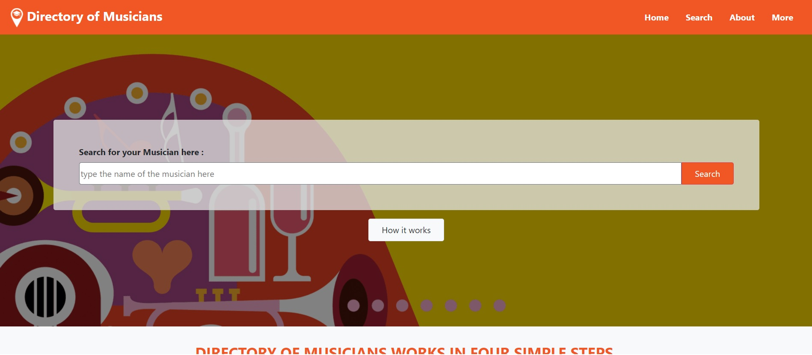

# Directory-of-Musicians (HTML CSS Capstone project)

The requirements for this project is to create 3 pages, a main page, a search results page and a details page. I created 5 details pages having different content. This project utilizes Bootstrap classes heavily and custom classes but created in the style of Bootstrap so I can use them again for newer projects.

I used 2 `.scss` files : one for general classes that I can use in any project and one for project specific classes.

### Screenshot

## Built With

- HTML
- CSS
- SASS
- Bootstrap

## Live Demo

[Live demo link](https://aymenbida.github.io/Directory-of-Musicians/)

## Getting Started

To get a local copy up and running follow these simple steps.

- `git clone git@github.com:AymenBida/Directory-of-Musicians.git`
- `cd Directory-of-Musicians`
- open index.html with a navigator of your choice

## Author

👤 **Aymen Bida**

- GitHub: [@AymenBida](https://github.com/AymenBida)

## 🤝 Contributing

Contributions, issues, and feature requests are welcome!

## Show your support

Give a ⭐️ if you like this project!

## Acknowledgments

- [Microverse](https://www.microverse.org/) for their `README` [template](https://github.com/microverseinc/readme-template).
- Design idea by Mathew Njuguna and others on Behance

## 📝 License

Copyright 2020 Aymen Bida

Permission is hereby granted, free of charge, to any person obtaining a copy of this software and associated documentation files (the "Software"), to deal in the Software without restriction, including without limitation the rights to use, copy, modify, merge, publish, distribute, sublicense, and/or sell copies of the Software, and to permit persons to whom the Software is furnished to do so, subject to the following conditions:

The above copyright notice and this permission notice shall be included in all copies or substantial portions of the Software.

THE SOFTWARE IS PROVIDED "AS IS", WITHOUT WARRANTY OF ANY KIND, EXPRESS OR IMPLIED, INCLUDING BUT NOT LIMITED TO THE WARRANTIES OF MERCHANTABILITY, FITNESS FOR A PARTICULAR PURPOSE AND NONINFRINGEMENT. IN NO EVENT SHALL THE AUTHORS OR COPYRIGHT HOLDERS BE LIABLE FOR ANY CLAIM, DAMAGES OR OTHER LIABILITY, WHETHER IN AN ACTION OF CONTRACT, TORT OR OTHERWISE, ARISING FROM, OUT OF OR IN CONNECTION WITH THE SOFTWARE OR THE USE OR OTHER DEALINGS IN THE SOFTWARE.